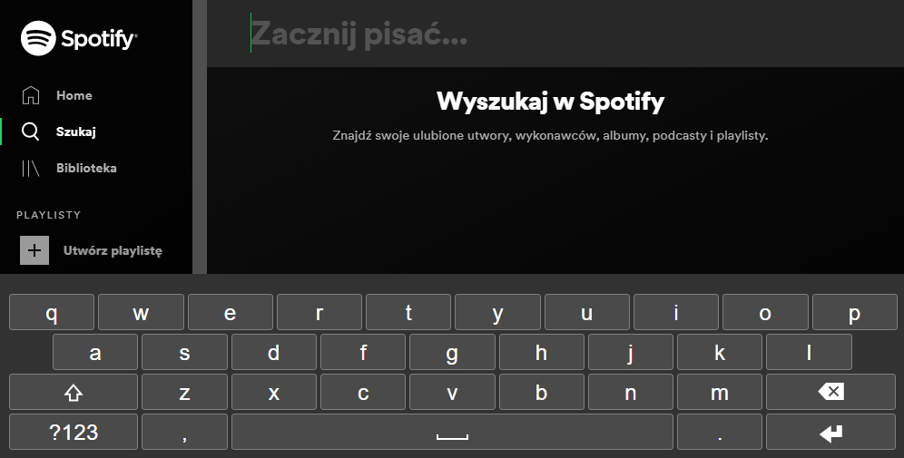

# Native Virtual Keyboard [chrome-extension](https://chrome.google.com/webstore/detail/native-virtual-on-screen/jnoclgeeaiidamofdlbnakfgkanggnla)

Native on-screen keyboard for touch screen devices. What differs it from any other keyboard on WebStore? Well, it sends native javascript events on every keystroke, so it works on any website, with any framework like React, Angular, Vue etc. (works on Spotify website too!).
Great for mobile and IoT devices like raspberry pi.

## Contributing

Everyone is very welcome to contribute to this project.
You can contribute just by submitting bugs or suggesting improvements by
[opening an issue on GitHub](https://github.com/vaverix/Native-Virtual-Keyboard-chrome-extension/issues).

## License

Licensed under [MIT License](LICENSE).
